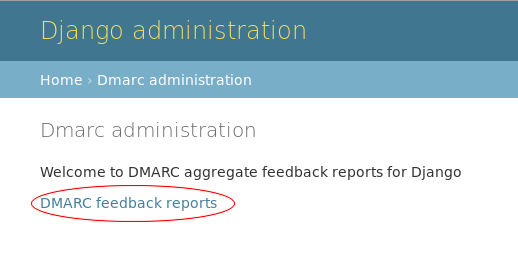
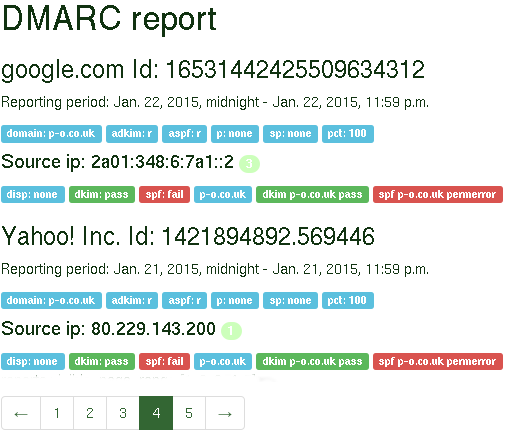

=============
Documentation
=============

**Managing DMARC aggregate and feedback reports**

Designed to quickly and easily manage DMARC aggregate and feedback reports.

Description
===========

This Django DMARC project aims to ease implementating DMARC
"Domain-based Message Authentication, Reporting & Conformance" and
ongoing monitoring by importing aggregate and feedback reports about messages
that pass and/or fail DMARC evaluation into a more easily digested format.

Perhaps one of the main reasons DMARC is gaining traction amongst
organisations of all sizes is a desire to protect their people, brand and
reputation.
By defining and implementing a DMARC policy, an organization can help combat
phishing, protect users and their reputation.

At beta stage, the application is stable, with most efforts on improving
usability and documentation.

Choosing Django was an easy choice as it offers an easily built import
mechanism and transformation from xml to database through to presentation.

Although it has options for importing either xml or email files, zero
maintenance is achieved by fully automating import of feedback and reports.

Quick start
===========

1. Install the app

2. Add "dmarc" to your INSTALLED_APPS setting::

    INSTALLED_APPS = (
        ...
        'dmarc',
    )

3. Add dmarc.urls to your urls::

    from dmarc import urls as dmarc_urls

    urlpatterns = [
        ...
        url(r"^dmarc/", include(dmarc_urls)),
    ]

4. Run 'python manage.py migrate' to create the database models.

5. Import a report with::

    python manage.py importdmarcreport --email

6. See your aggregated feedback reports from the Admin page at admin/dmarc

Usage
=====
python manage.py importdmarcreport --email

You can choose to import an xml or email file, alternatively with "--email -"
you can pipe an email and it will do the right thing.

Installation
============

Install the app

Configuration
-------------

Add "dmarc" to your INSTALLED_APPS setting::

    INSTALLED_APPS = (
        ...
        'dmarc',
    )

Add dmarc.urls to your urls::

    from dmarc import urls as dmarc_urls

    urlpatterns = [
        ...
        url(r"^dmarc/", include(dmarc_urls)),
    ]

DMARC reports are namespaced so if you're using django version 1.8 you will
need to add the namespace 'dmarc'::

    urlpatterns = [
        ...
        url(r"^dmarc/", include(dmarc_urls, namespace='dmarc')),
    ]

Install tables
--------------

Run 'python manage.py migrate' to create the database tables.

Import feedback report
----------------------

Import an email DMARC aggregate report with::

    python manage.py importdmarcreport --email

Alternatively the xml report can be imported with::

    python manage.py importdmarcreport --xml

The process of importing DMARC aggregate reports can be fully automated. At
Persistent Objects we use Exim and the configuration couldn't be easier.

Router::

    dmarcreports:
        driver = accept
        condition = ${if eq{$local_part}{dmarc_report}}
        transport = trans_dmarcreports

Transport::

    trans_dmarcreports:
        driver = pipe
        command = "/usr/local/bin/python2.7 /path/to/manage.py importdmarcreport --email -"
        freeze_exec_fail = true
        return_fail_output = true

Congratulations, you have django-dmarc installed and ready to import DMARC
aggregate feedback reports and start implementing DMARC and protecting your
emails.

DMARC reporting
===============

Aggregated feedback reports are available from the Admin page at admin/dmarc.

.. image:: images/dmarc-index.png
   :alt: Django Administration showing this DMARC application

From the DMARC dashboard at 'Site administration/DMARC' where the intention is
to highlight a summary of recent reports, there is one report 'DMARC feedback
reports' and is available to any user with staff members authorization.

This is an example report, it can also be downloaded as a csv file suitable
for importing into your favourite spreadsheet.

The report can be filtered by clicking on the filter and changing any of the
reporting period, only showing errors/failures, disposition (quarantine,
rejection or any) and by source ip address/reporting organisation.

.. image:: images/dmarc-reportfilter.png
   :alt: Example DMARC aggregate feedback report

These reports can help ease any DMARC implementation.

Maintenance
===========

Although there is usually no need to remove old records, access to the report
table is offered to allow for record deletion.

Dependencies
============

* `Django`_ 1.8+

Resources
=========

* `DMARC`_
* `Django`_
* `Google gmail DMARC`_
* `Download from PyPI`_

Support
=======

To report a security issue, please send an email privately to
`ahicks@p-o.co.uk`_. This gives us a chance to fix the issue and
create an official release prior to the issue being made
public.

For general questions or comments, please contact  `ahicks@p-o.co.uk`_.

`Project website`_

Communications are expected to conform to the `Django Code of Conduct`_.

.. GENERAL LINKS

.. _`Django`: http://djangoproject.com/
.. _`Django Code of Conduct`: https://www.djangoproject.com/conduct/
.. _`Python`: http://python.org/
.. _`Persistent Objects Ltd`: http://p-o.co.uk/
.. _`Project website`: http://p-o.co.uk/tech-articles/django-dmarc/
.. _`DMARC`: http://dmarc.org/
.. _`Google gmail DMARC`: https://support.google.com/a/answer/2466580
.. _`Download from PyPI`: https://pypi.python.org/pypi/django-dmarc

.. PEOPLE WITH QUOTES

.. _`Alan Hicks`: https://twitter.com/AlanHicksLondon
.. _`ahicks@p-o.co.uk`: mailto:ahicks@p-o.co.uk?subject=django-dmarc+Security+Issue
